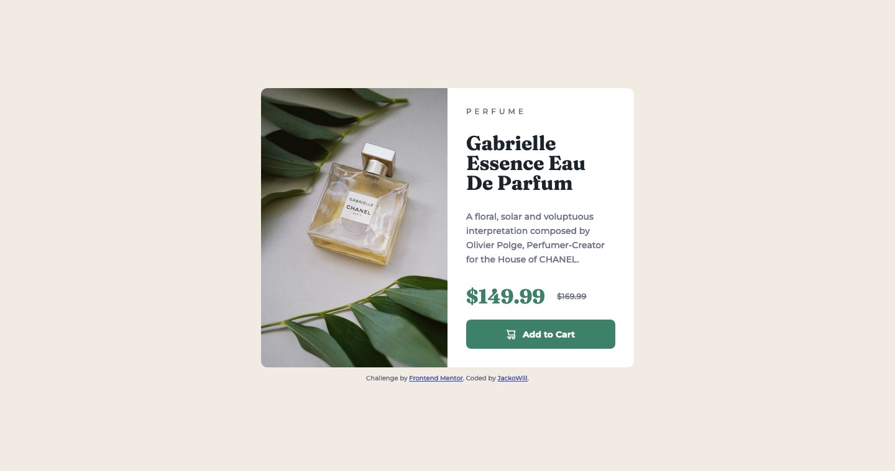

# Frontend Mentor - Product preview card component solution

This is a solution to the [Product preview card component challenge on Frontend Mentor](https://www.frontendmentor.io/challenges/product-preview-card-component-GO7UmttRfa). Frontend Mentor challenges help you improve your coding skills by building realistic projects.

## Table of contents

- [Overview](#overview)

  - [The challenge](#the-challenge)
  - [Screenshot](#screenshot)
  - [Links](#links)

  - [Built with](#built-with)
  - [What I learned](#what-i-learned)
  - [Continued development](#continued-development)

- [Author](#author)

## Overview

Product preview card with hover and focus state.

### The challenge

Users should be able to:

- View the optimal layout depending on their device's screen size
- See hover and focus states for interactive elements

### Screenshot

### Links

- Solution URL: [https://mellow-raindrop-54c373.netlify.app/]
- Live Site URL: [https://www.frontendmentor.io/solutions/responsive-product-preview-card-component-utpOXrYDFt]

### Built with

- Semantic HTML5 markup
- Flexbox
- CSS Grid
- Mobile-first workflow

### What I learned

This was my first project attempting Mobile-first workflow.
I learned how to change the product image from the mobile img provided to the desktop img using a src set, and then setting the media querie on that so it changes from one image to the other.

### Continued development

I really want to continue learning grid and media queries aswell as making my projects responsive using the mobile-first approach .

## Author

- Frontend Mentor - [@JackoWill](https://www.frontendmentor.io/profile/JackoWill)
